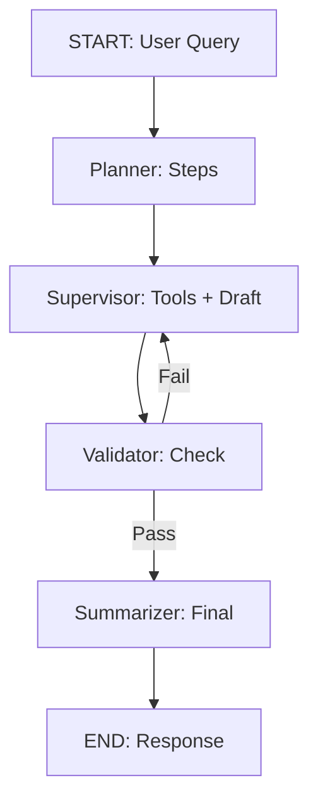

# KekAI 🚀🔍 — Твой Личный Исследователь-Шпионажник для Кода и Фактов

  
*(Представь: нейронка в стиле "Брат-2" — ищет правду, как Данила Багров ищет правду в Чикаго. Только без пулемёта.)*

## Что это за хрень? 🤔

**KekAI** — это не просто чатбот, а полноценный **AI-ассистент для исследований**, построенный на LangGraph и Streamlit. Идеален для тех, кто устал от копипасты в StackOverflow и хочет **быстро копать в факты, код и данные**. 

- **Simple Mode (⚡)**: 30 секунд на ответ — как кофе из автомата в офисе Сбера. Веб-поиск + факты, без воды.
- **Pro Mode (🔬)**: Глубокий анализ с инструментами (Tavily, Arxiv, E2B Code Exec) — для тех, кто пишет доклады для босса или статьи для ИТМО-конференции.

Под капотом: LangChain + OpenAI-совместимые модели (Qwen, Mistral). Масштабируемо, как микросервис в Kubernetes, но запускается локально за 5 минут.

*Почему для вас, 40-летних кодеров из Сбера/ИТМО?* Потому что это не игрушка для зумеров — это инструмент, который **экономит часы на ревью кода, проверку гипотез и генерацию отчётов**. Как старый добрый Vim с плагинами: мощно, надёжно, без лишнего блеска.

## Крутые Фичи 🎯

| Фича | Описание | Почему это пиздец как полезно |
|------|----------|-------------------------------|
| **Двойной Режим** | Simple: 1-3 источника, быстрый ответ. Pro: 5+ источников, код-анализ, Arxiv. | Simple — для "срочно, бля". Pro — для "надо идеально, как в PhD". |
| **Инструменты на Борту** | Web Search (Tavily), Browse Pages, Code Exec (E2B Sandbox), Arxiv, Image Desc. | Запусти Python в песочнице — проверь алгоритм на реальных данных. Без Docker-танцев. |
| **Валидация & Циклы** | Авто-проверка ответа: если фигня — перезапускает. Макс 2 фейла. | Нет "галлюцинаций" — только факты. Как unit-тесты для нейронки. |
| **UI как у Netflix** | Streamlit с темной стороной: чат, сайдбар, экспандеры для логов. | Красиво, но не раздражает. Сохраняет историю — не потеряешь контекст. |
| **Логи & Отладка** | KekAI.log + DEBUG_MODE в .env. | Для параноиков: "Что эта хрень сделала под капотом?" |

## Быстрый Старт 🚀 (5 мин, без Kubernetes)

1. **Клонируй репозиторий**:
   ```
   git clone https://github.com/yourusername/kekai.git
   cd kekai
   ```

2. **Установи зависимости** (Python 3.10+):
   ```
   pip install -r requirements.txt
   # Или poetry install, если ты в теме
   ```

3. **Настрой .env** (скопируй из .env.example):
   ```
   API_KEY=your_openai_or_openrouter_key
   BASE_MODEL=qwen2.5-coder-7b-instruct  # Или mistral, что у тебя
   BASE_URL=https://openrouter.ai/api/v1  # Опционально
   E2B_API_KEY=your_e2b_key  # Для code_exec
   DEBUG_MODE=true  # Для логов
   MAX_RESULTS=5
   ```

4. **Запусти**:
   ```
   streamlit run ui.py
   ```
   Открой `http://localhost:8501`. Задай вопрос: "Сколько Оскаров у 'Титаника'?" — и смотри магию.

*Про-совет:* Для Сбера — интегрируй с внутренним API (добавь tool). Для ИТМО — подключи к Jupyter для студенческих лаб.

## Примеры Использования 💡

- **Simple:** "Что такое LangGraph?" → Мгновенный сниппет из 3 источников.
- **Pro:** "Сравни производительность PyTorch vs TensorFlow на GPU для NLP-задач." → План → Поиск → Code Exec (бенчмарк) → Отчёт с графиками.
- **Кодовый Кейс:** "Отладь этот скрипт на pandas." → Загрузи файл, tool проанализирует.

Скриншот UI (в Pro с логами):


## Архитектура (Для Гиков) 🛠️

- **Graph Flow (LangGraph):** Planner → Supervisor (Tools) → Validator → Summarizer. Цикл на фейлах.
- **State:** TypedDict с messages, plan, draft, validated.
- **Tools:** Tavily (search), BeautifulSoup (browse), Arxiv, E2B (sandboxed Python), Vision (Mistral).
- **LLMs:** Partial-функции с temp=0.05 для стабильности. Поддержка Qwen/Mistral via OpenRouter.

Диаграмма (Mermaid, если GitHub рендерит):


Масштаб: Легко в Docker/Cloud Run. Для enterprise — добавь Redis для state.

## Лицензия & Контакты 📄

MIT License — бери, пили, не благодари.

Автор: [Твой Ник] (@github) | Email: kekai@dev.ru  
Или в X: [@kekai_dev](https://x.com/kekai_dev) — там мемы про legacy code.

**Stars?** Если зашло — жми ⭐. Для Сбера/ИТМО: deploy'ни в prod и расскажи, как сэкономил 100 часов на research.

*Powered by xAI Grok? Нет, но могло бы. 😏*  
*Версия: v1.0 (Ноябрь 2025) — будущее уже здесь, братан.*
